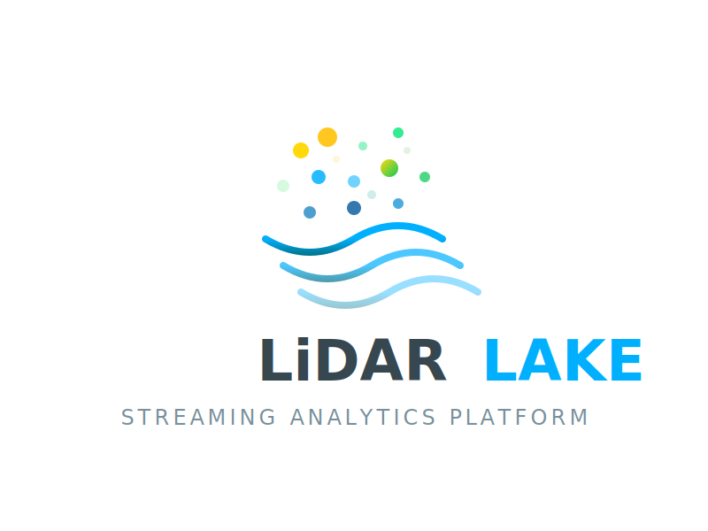

LiDAR Lake

<h3>Real-time LiDAR Processing & Analytics Lakehouse</h3>

🚀 Executive Summary

LiDAR Lake is a scalable, on-premise Data Lakehouse architecture designed to ingest, clean, and analyze high-volume LiDAR sensor data from autonomous vehicles. It addresses the critical challenges of Volume (1.3 GB/min per car), Noise (unstructured point clouds), and Cost (avoiding expensive cloud storage fees).

By transforming raw .ply sensor streams into structured Voxels stored in Apache Iceberg, we enable real-time analytics, "Time Travel" debugging, and rapid AI model training.

🏗️ Architecture

The system follows a Lambda Architecture with distinct layers for speed and reliability.

graph LR
    Sensors(LiDAR Sensors) -->|Raw Stream| Kafka(Apache Kafka)
    Kafka -->|Ingest| Flink(Apache Flink)
    Flink -->|Clean & Filter| HDFS(HDFS / MinIO)
    HDFS -->|Batch Processing| Spark(Apache Spark)
    Spark -->|Voxelization| Iceberg(Apache Iceberg)
    Iceberg -->|Analytics| ML(TensorFlow Model)
    Iceberg -->|Visualization| QGIS(QGIS & CloudCompare)

Key Components

Ingestion (Kafka): Decouples high-speed sensor data from processing to ensure zero data loss.

Streaming (Flink): Performs real-time cleaning (noise filtering) before data hits the disk.

Storage (HDFS/MinIO): Cost-effective, distributed raw storage.

Lakehouse (Spark + Iceberg): transforms raw points into structured Voxels ($1m^3$ cubes) and provides ACID compliance + Time Travel.

Intelligence (TensorFlow): A Neural Network trains on Voxel features (Intensity, Density) for spatial-invariant object detection.

Observability (Prometheus + Grafana): Monitors pipeline health (CPU, Memory, Ingestion Lag).

🛠️ Tech Stack

Streaming: Apache Kafka, Apache Flink

Processing: Apache Spark (PySpark)

Storage: Hadoop HDFS, MinIO (S3 Compatible)

Table Format: Apache Iceberg

Orchestration: Apache Airflow

ML & Viz: TensorFlow, CloudCompare, QGIS

Languages: Python 3.10, Java 17

📦 Installation & Setup

Prerequisites

Linux Environment (Ubuntu/Xubuntu recommended)

Java 17 (Required for Spark 3.5 + Iceberg)

Python 3.10+

1. Clone the Repository

git clone [https://github.com/yourusername/lidar-lake.git](https://github.com/yourusername/lidar-lake.git)
cd lidar-lake

2. Install Dependencies

pip install -r requirements.txt
# Key libraries: pyspark==3.5.3, kafka-python, plyfile, tensorflow

3. Start Infrastructure (Local Mode)

If running locally, start your Zookeeper, Kafka, and Flink instances:

# Start Zookeeper
./kafka/bin/zookeeper-server-start.sh config/zookeeper.properties

# Start Kafka
./kafka/bin/kafka-server-start.sh config/server.properties

# Start Flink
./flink/bin/start-cluster.sh

🚀 Usage Guide

Step 1: Ingest Data (Producer)

Simulate a LiDAR sensor stream from a .ply file.

python3 src/producer.py

Step 2: Clean Data (Flink)

Start the streaming job to filter noise and write JSON to HDFS.

python3 src/flink_cleaning.py

Step 3: Process to Lakehouse (Spark)

Run the batch job to Voxelize data and write to Iceberg.

# Ensure Java 17 is set
export JAVA_HOME=/usr/lib/jvm/java-17-openjdk-amd64
python3 src/spark_voxel_job.py

Step 4: Export for Visualization

Generate a CSV for QGIS or CloudCompare.

python3 src/export_for_qgis.py

Step 5: Train AI Model

Train the neural network on the structured Voxel data.

python3 src/ml_voxel_classifier.py

📊 Results

Compression: Reduced raw point cloud size by ~90% via Voxelization.

Performance: Achieved sub-second query latency for specific object classes (e.g., "Select all Cars") using Partition Pruning.

Cost: Eliminated cloud storage fees by utilizing on-premise commodity hardware.

👥 Team G13

**Mostafa